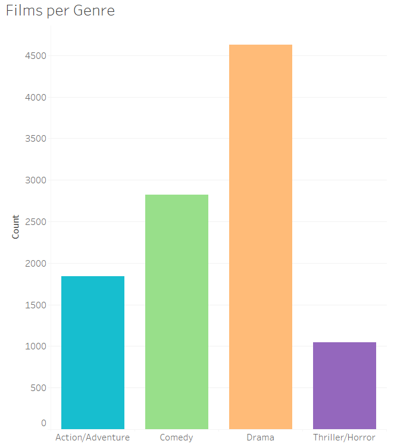
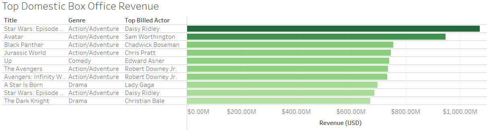
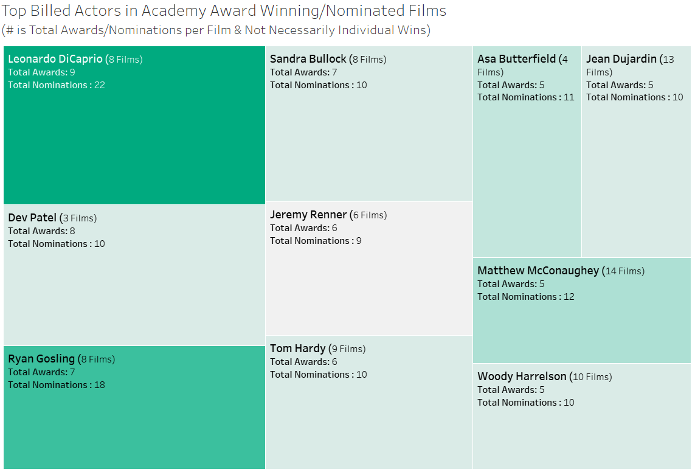

# **Defining Film Success With Unsupervised Learning**
*Lighthouse Labs Final Project - Annie Stanley*

## README
-   [Repo Navigation](#repo-navigation)
-   [Presentation PDF](./results/Final%20Project%20Presentation.pdf)
-   [Table of Contents](#table-of-contents)
-   [Resources & Credits](#resources)

### **Repo Navigation**
-   [Data Acquisition](/acquisition/)
    -   CSVs:
        -   `links.csv` - movielens data
        -   `tmdb_raw_data.csv` - raw, uncleaned data from TMDB acquired via API request
        -   `omdb_raw_data.csv` - raw, uncleaned data from OMDb acquired via API request
    -   Notebooks:
        -   `api_calls` - contains API requests & basic json parsing
    -   Python Files:
-   [Data Preparation](/preparation/)
    -   CSVs:
    -   Notebooks:
    -   Python Files:
-   [Modeling](/modeling/)
    -   CSVs:
    -   Notebooks:
    -   Python Files:
-   [Results](/results/)
    -   CSVs:
    -   Notebooks:
    -   Python Files:

### **Table of Contents:**
1.  [Project Outline](#1-project-outline)
    -   General description outlining methods, goals & hypotheses
2.  [Hypotheses](#2-hypotheses)
    -   Detailed hypotheses
3.  [Data Cleaning & Acquisition](#3-data-acquisition--cleaning)
    -   Brief overview of data cleaning performed
4.  [EDA](#4-eda)
    -   Overview of general insights
    -   Detailed EDA run-down
    -   Fun facts discovered through exploration
5.  [Modelling](#5-modeling)
    -   Overview of feature engineering & selection process
    -   Details on model creation & evaluation
6.  [Results](#6-results)
    -   Brief description of results
    -   Detailed analysis of results

## 1. Project Outline
- In today's ever changing market, knowing exactly what drives people to the theatre is invaluable information. How exactly do we measure success, and how to we achieve it?
- Most judge success based on revenue, so I wanted to look into what factors correlate to a higher box office release. Others may factor in critical and audience reception scores, so those, as well as award wins and nominations, were also investigated.
- This project will use unsupervised learning, namely clustering, to investigate the success of different films, broken down by genre.
-   API and web scraping will be the main means of data acquisition, as well as the MovieLens dataset.

## 2. Hypotheses
- I am working under the hypothesis that action and family movies will have higher revenue, but lower critical reception, and dramatic films will have lower box office releases but higher rates of awards and high critical scores.
- I also believe that specific actors will have less of an impact on box office release than we suspect.
## 3. Data Acquisition & Cleaning
- Initial data was acquired via MovieLens, which has a sample of ~62 000 movies, from here I culled the data down to a sample of ~25 000 by excluding any pre-2007 films (2007 being the year that Netflix introduced streaming to its services).
- Each film ID was then run through the TMDB & OMDB APIs to gather as many possible details
- The Wikipedia entry for Academy Awards was also scraped for a small sample of award data
- Since the box office data was inconsistent across the different sources, BoxMojo was scraped to get consistent domestic box office revenue data across the board
- The acquired revenue data was not adjusted for inflation, so this was adjusted using the CPI python package
## 4. EDA
- There were a wide variety of different genres assigned to each movie, so I broke them down into four main genres (Drama, Action/Adventure, Comedy, and Thriller/Horror), and assigned secondary sub-genres
    -   Action/Adventure (1,839)
    -   Comedy (2,819)
    -   Drama (4,624)
    -   Thriller/Horror (1,048)

-   Action/Adventure as a genre appeared to be the most profitable overall, which is unsurprising given the success of superhero movies and the Marvel Cinematic Universe over the past decade
-   As seen below, the majority of the top performing films were Action/Adventure

-   In terms of ratings, critics tended to favour dramas, and audiences tended to give higher scores in general (with the exception of dramas)
-   The five actors who were associated with the most profitable movies were
    -   Robert Downey Jr (associated with 2.34% of total profits)
    -   Chris Pratt (associated with 1.41% of total profits)
    -   Jennifer Lawrence   (associated with 1.21% of total profits)
    -   Christian Bale (associated with 1.15% of total profits)
    -   Steve Carell (associated with 1.15% of total profits)

-   These actors are all associated with highly sucessful and profitable series
-   Leonardo DiCaprio is also associated with the most Academy Award winning & nominated films

## 5. Modeling
-   Data was broken down into the four genres for clustering
-   All data was scaled for PCA, using either StandardScaler, MinMaxScaler, or RobustScaler, depending on how each scaler performed
-   From there, scree plots were generated to determine the optimal number of clusters per genre
-   This was an iterative process, with the scalers, features, and number of features, adjusted for each iteration based on performance
-   Clusters were then determined by either K-Means, Hierarchical, or DBSCAN, and chosen based off of their best silhouette scores
-   Comedy worked best with Hierarchical clustering, and the other genres performed best with K-Means

-   Data loss was tried to keep to a minimal, although Action/Adventure suffered a loss of 29%
-   Silhouette scores were all above a 0.25, which does indicate fairly distinct clusters
-   Ideally, I would love to get these scores to be above a 0.7, with less than 15% data loss
## 6. Results
### **Results Overview**
### Drama
-   4 x clusters
-   Cluster 2 was top performing even with log transformations & outlier removals
-   Cluster 2 also had the strongest ratings across the board
-   Possibly due to a combination of star power (e.g. Lady Gaga) and franchise power (the Christian Bale Batman films)
### Action/Adventure
-   3 x clusters
-   Cluster 0 was top performing in ratings & revenue
    -   Lots of big name actors in repeat roles
    -   Lots of actors that have been known for their more dramatic roles (e.g. Tom Cruise, Denzel Washington, Liam Neeson)
-   Cluster 2 had fewer big name/repeat actors
-   Cluster 1 seemed more focused on straight action films with actors such as Jason Statham, Steven Seagal, Dwayne Johnson
### Comedy
-   2 x clusters
-   No clear top performer, unlike other clusters
-   Cluster 0 has higher revenue, but cluster 1 has higher ratings
-   Humour is incredibly subjective, and it seems like some talent are associated with higher revenue, but others have higher ratings
    -   Which could be that the average public are more happy to pay to go see something more silly, for example, that a critic won't appreciate as much
### Thriller/Horror
-   3 x clusters
-   Cluster 2 had higher revenue as well as higher ratings
    -   Had the most repeat actors
-   Horror movies tend to be much more niche, which may lead to less of a draw for more well established actors

### **Detailed Results**
### Drama
-    How many movies are in each cluster?
        -    C0: 1,474
        -    C1: 2,169
        -    C2: 59
        -    C3: 922
-    What's the average & median box office revenue per cluster?
        -    Average:
                -    C0: $4.99M
                -    C1: $8.74M
                -    C2: $107.21M
                -    C3: $1.26M
        -    Median:
                -    C0: $0.15M
                -    C1: $0.55M
                -    C2: $70.59M
                -    C3: $0.17M
-    Which actors are seen the most in each cluster?
        -    C0:
                -    Robert Pattinson (5)
                -    Naomi Watts (5)
                -    Zac Efron (4)
                -    Woody Harrelson (4)
                -    Keanu Reeves (4)
        -    C1:
                -    Michelle Williams (7)
                -    Jake Gyllenhaal (6)
                -    Tom Hardy (5)
                -    Saoirse Ronan (5)
                -    Michael Fassbender (5)
        -    C2:
                -    Keira Knightley (2)
                -    Eddie Redmayne (2)
                -    Daniel Day-Lewis (2)
                -    Viola Davis (1)
                -    Viggo Mortensen (1)
        -    C3:
                -    Ricardo Darin (9)
                -    Mario Casas (6)
                -    Gael Garcia Bernal (6)
                -    Wagner Moura (5)
                -    Maribel Verdu (5)
-    What's the median rating of each cluster?
        -    C0:
                -    IMDB (Audience): 58
                -    Metacritic (Critic): 50
                -    Rotten Tomatoes (Critic): 48
        -    C1:
                -    IMDB (Audience): 68
                -    Metacritic (Critic): 68
                -    Rotten Tomatoes (Critic): 75.21
        -    C2:
                -    IMDB (Audience): 78
                -    Metacritic (Critic): 84
                -    Rotten Tomatoes (Critic): 91
        -    C3:
                -    IMDB (Audience): 66
                -    Metacritic (Critic): 65
                -    Rotten Tomatoes (Critic): 67.43
-    How well does each cluster do in regards to the academy awards?
        -    C0: 5 awards per x1,474 films (0.34% chance of award)
        -    C0: 6 nominations per 1,474 films (0.41% chance of nomination)
        -    C1: 29 awards per 2,169 films (1.34% chance of award)
        -    C1: 50 nominations per 2,169 films (2.31% chance of nomination)
        -    C2: 59 awards per 130 films (220.34% chance of award)
        -    C2: 408 nominations per 59 films (691.53% chance of nomination)
                -    Every single film in this category has at least one award & one nomination
        -    C3: 5 awards per 922 films (0.54% chance of award)
        -    C3: 7 nominations per 922 films (0.76% chance of nomination)
### Action/Adventure
-   How many movies are in each cluster?
    -   C0: 762
    -   C1: 709
    -   C2: 368
-   What's the average & median box office revenue per cluster?
    -   Average:
        -   C0: $68.40M
        -   C1: $30.88M
        -   C2: $5.68M
    -   Median:
        -   C0: $2.98M
        -   C1: $1.68M
        -   C2: $0.89M
-   Which actors are seen the most in each cluster?
    -   C0:
        -   Robert Downey Jr (8)
        -   Denzel Washington (7)
        -   Tom Cruise (6)
        -   Liam Neeson (6)
        -   Chris Pratt (5)
    -   C1:
        -   Nicolas Cage (15)
        -   Jason Statham (10)
        -   Bruce Willis (10)
        -   Steven Seagal (6)
        -   Dwayne Johnson (6)
    -   C2:
        -   Erica Lindbeck (2)
        -   Will Arnett (1)
        -   Thomas Middleditch (1)
        -   Scott Adkins (1)
        -   Samian (1)
    -   What's the median rating of each cluster?
        -   C0:
            -   IMDB (Audience): 67
            -   Metacritic (Critic): 65
            -   Rotten Tomatoes (Critic): 70
        -   C1:
            -   IMDB (Audience): 55
            -   Metacritic (Critic): 44
            -   Rotten Tomatoes (Critic): 36
        -   C2:
            -   IMDB (Audience): 60
            -   Metacritic (Critic): 61
            -   Rotten Tomatoes (Critic): 61
-   How well does each cluster do in regards to the academy awards?
    -   C0: 47 awards per 762 films (6.17% chance of award)
    -   C0: 105 nominations per 762 films (13.78% chance of nomination)
    -   C1: 2 awards per 709 films (0.28% chance of award)
    -   C1: 3 nominations per 709 films (0.42% chance of nomination)
    -   C2: 0 awards per 368 films (0% chance of award)
    -   C2: 0x nominations per 368 films (0% chance of nomination)

### Comedy
-   What's the average & median box office revenue per cluster?
    -   Average:
        -   C0: $16.41M
        -   C1: $14.84M
    -   Median:
        -   C0: $1.24M
        -   C1: $1.38M
-   Which actors are seen the most in each cluster?
    -   C0:
        -   Will Ferrel (8)
        -   Steve Coogan (8)
        -   Steve Carrell (8)
        -   Anna Kendrick (6)
        -   Adam Sandler (6)
    -   C1:
        -   Adam Sandler (7)
        -   Will Ferrel (5)
        -   Vince Vaughn (5)
        -   Tyler Perry (5)
        -   Owen Wilson (5)
-   What's the median rating of each cluster?
    -   C0:
        -   IMDB (Audience): 53
        -   Metacritic (Critic): 41.88
        -   Rotten Tomatoes (Critic): 33
    -   C1:
        -   IMDB (Audience): 63
        -   Metacritic (Critic): 61.55
        -   Rotten Tomatoes (Critic): 63.83
-   How well does each cluster do in regards to the academy awards?
    -   C0: 2 awards per 787 films (0.25% chance of award)
    -   C0: 4 nominations per 787 films (0.51% chance of nomination)
    -   C1: 32 awards per 2,032 films (1.57% chance of award)
    -   C1: 86 nominations per 2,032 films (4.23% chance of nomination)

### Thriller/Horror
-   What's the average & median box office revenue per cluster?
    -   Average:
        -   C0: $2.50M
        -   C1: $7.79M
        -   C2: $16.81M
    -   Median:
        -   C0: $0.56M
        -   C1: $0.12M
        -   C2: $0.41M
-   Which actors are seen the most in each cluster?
    -   C0:
        -   Belen Rueda (4)
        -   Elcin Atamguc (3)
        -   Viktoriya Agalakova (2)
        -   Toma Ikuta (2)
        -   Manuela Velasco (2)
    -   C1:
        -   Nicolas Cage (5)
        -   Tobin Bell (3)
        -   Kate Beckinsale (3)
        -   Josh Stewart (3)
        -   Taraji P. Henson (2)
    -   C2:
        -   Patrick Wilson (3)
        -   Jake Gyllenhaal (3)
        -   Vera Farmiga (2)
        -   Toby Jones (2)
        -   Riz Ahmed (2)
-   What's the median rating of each cluster?
    -   C0:
        -   IMDB (Audience): 59
        -   Metacritic (Critic): 59.84
        -   Rotten Tomatoes (Critic): 60
    -   C1:
        -   IMDB (Audience): 49
        -   Metacritic (Critic): 42.65
        -   Rotten Tomatoes (Critic): 35.52
    -   C2:
        -   IMDB (Audience): 62
        -   Metacritic (Critic): 59.91
        -   Rotten Tomatoes (Critic): 66
-   How well does each cluster do in regards to the academy awards?
    -   C0: 2 awards per 206 films (0.97% chance of award)
    -   C0: 2 nominations per 206 films (0.97% chance of nomination)
    -   C1: 0 awards per 443 films (0% chance of award)
    -   C1: 0 nominations per 0 films (0% chance of nomination)
    -   C2: 3 awards per 399 films (0.75% chance of award)
    -   C2: 7 nominations per 399 films (1.75% chance of nomination)

### **Resources:**
-   [The Open Movie Database (OMDb) API](https://www.omdbapi.com/)
-   [The Movie Database (TMDB) API](https://developers.themoviedb.org/3)
-   [MovieLens Dataset ('Small' dataset used for this project)](https://grouplens.org/datasets/movielens/)